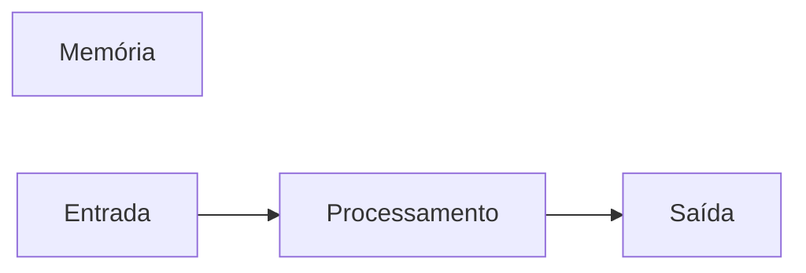

# javascript
repositorio usado para estudo de logica de programaçao com uso de java 
## Autor
Gustavo santana 
## Variáveis

## Variáveis

Variáveis são espaços na memória do computador usado para guardar valores que podem alterar ao longo do programa.

### Principais tipos primitivos:

- strings ( Texto )

- number ( números inteiros e não inteiros )

- boolean ( Verdadeiro ou falso )

 
## Operadores Aritméticos

| Operador | Propósito | Exemplo | Resulado |

|----------|-----------|---------|----------|

| = | Atribuir um valor | x = 10 | x = 10 |

| + | Somar | 10 + 5 | 15 |

| += | Somar e atribuir | x += 5 | x = 15 |

| - | Subtrair | 15 -10 | 5 |

| -= | Subtrair e atribuir | x -= 10 | x = 5 |

| * | Multiplicar | 5 * 10 | 20 |

| *= | Multiplicar e atribuir | x *= 4 | x = 20 |

| / | Dividir | 20 / 2 | 10 |

| /= | Dividir e atribuir | x /= 2 | 10 |

| ++ | Somar 1 ao resultado | x ++ | 11 |

| -- | Subtrair 1 do resultado | x -- | 9 |

| % | Resto da  divisão | 9 % 3 | 0 |

 
