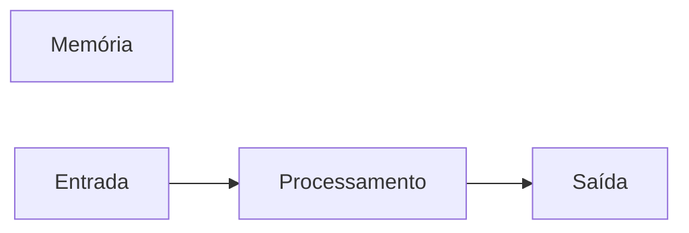

# javascript
repositorio usado para estudo de logica de programaçao com uso de java 
## Autor
Gustavo santana 
## Variáveis

Variáveis são espaços na memória do computador usado para guardar valores que podem alterar ao longo do programa.

### Principais tipos primitivos:

- strings ( Texto )

- number ( números inteiros e não inteiros )

- boolean ( Verdadeiro ou falso )

 
## Operadores Aritméticos

| Operador | Propósito | Exemplo | Resulado |

|----------|-----------|---------|----------|

| = | Atribuir um valor | x = 10 | x = 10 |

| + | Somar | 10 + 5 | 15 |

| += | somar e atribuir | x += 5 | x = 15 |
 
